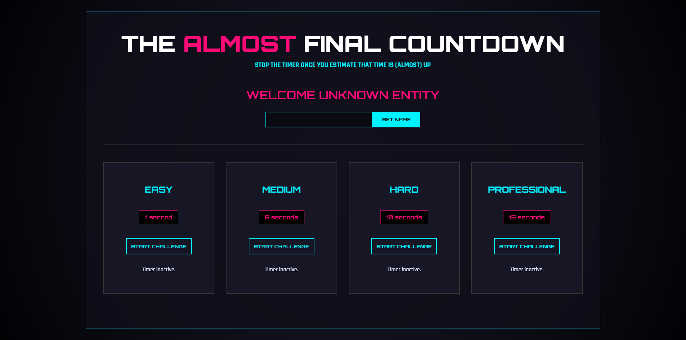

# Just In Time

**Just In Time** is a precision-based timing game built with **React**, using **Hooks** (`useRef`, `useState`, `useImperativeHandle`) and **Portals** to test your internal clock. Featuring a custom **"Cyber-Neon" Gaming UI** with high-contrast visuals and glitch animations, the app calculates your accuracy in real-time to provide a precise score upon completion. The entire experience is built with a **mobile-first** approach.

**[Live Demo](https://just-in-time-pearl.vercel.app/)**



## Getting Started

1.  **Clone the repository**
    ```bash
    git clone https://github.com/sujoy-kr/just-in-time.git
    ```
2.  **Install dependencies**
    ```bash
    npm install
    ```
3.  **Run the development server**
    ```bash
    npm run dev
    ```
